# Data Lovers

## Índice

<<<<<<< HEAD
* [Definición de Producto](#Definición-de-Producto)
* [Historias de Usuario](#Historias-de-Usuario)
* [Diseño de la Interfaz de Usuario](#Diseño-de-la-Interfaz-de-Usuario)
* [Implementación de la Interfaz de Usuario (HTML/CSS/JS)](#Implementación-de-la-Interfaz-de-Usuario-(HTML/CSS/JS))
* [Pruebas Unitarias](#Pruebas-Unitarias)

## Definición de Producto

PokeLover es una aplicación web que permitirá a los usuarios (principalmente jugadores de Pokémon GO) poder manejar información relevante de cada Pokémon e interactuar con ella para sacar ventaja respecto a los otros maestros Pokémon que aun no conocen nuestra app.

El desarrollo de las funciones que contiene la aplicación estan basadas en entrevistas realizadas a los potenciales consumidores de nuestro producto, estas entrevistas se resumieron en 3 historias de usuario especificadas líneas abajo en el siguiente punto.

La primera función es el filtro de los pokemones según tipo, como segunda utilidad tenemos el ordenamiento alfabetico ascendente y descendente, como tercera función el usuario podrá determinar cual es el pokemon con mayor incidencia entre los 150 de la Región Kanto.

El acceso a la aplicación Web "PokeLover" es mediante el siguiente Link: https://mayratc.github.io/lim-2018-11-bc-core-am-data-lovers/src/ , y se pude visualizar por cualquier dispositivo electrónico.

## Historias de Usuario
- Historia de Usuario N°1:

  "Yo como usuario de Pokemon GO, necesito clasificar los pokemones según el tipo al cual pertenecen."

  // La Definición de terminado es que a un lado de la pantalla se muestren botones con los diferentes nombres de los tipos de pokemones y que al usuario darle click a cada una de ellas, en otro lado de la pantalla figuren cards con los pokemones ordenados según el tipo que el usuario escogió.
- Historia de Usuario N°2:

  "Yo como usuario de Pokemon GO, desearia poder ordenar alfabeticamente a los Pokemones".

  // La Definicion de terminado de esta historia es: el menu de navegación de la aplicacion deberia mostrar un acceso con el nombre "ORDENAR", al darle click deberia mostrarnos una pantalla con dos opciones "ASCENDENTE" y "DESCENDENTE", al darle click a los botones se deberian mostrar cards de cada pokemon, y deberian estar ordenados alfabeticamente según la opcion elegida.

- Historia de Usuario N°3:

  "Yo como usuario de Pokemon Go, quiero saber cuál es el pokemon con mayor incidencia dentro de los 150 pokemones de la región de Kanto."

  //La Definición de terminado aqui seria un boton en el menu de navegación con el nombre "POKECIENTIFICO" en el cual al darle click la pantalla muestre un boton con el nombre "MAS POSIBILIDADES" y éste último al darle click muestre en pantalla la card del pokemon con mayor % de incidencia.

- Historia de Usuario N°4:

  "Yo como usuario de Pokemon Go, quiero saber cuál es el pokemon con mayor evolucion dentro de los 150 pokemones de la región de Kanto."

  //La Definición de terminado aqui seria un boton en el menu de navegación con el nombre "POKECIENTIFICO" en el cual al darle click la pantalla muestre un boton adicional con el nombre "MAYOR EVOLUCION" y éste último al darle click muestre en pantalla la card del pokemon con mayor evolucion.

## Diseño de la Interfaz de Usuario
- Prototipo de Baja Fidelidad.

  Para trabajar los prototipos de baja fidelidad, se testearon las soluciones con los usuarios potenciales, se muestran líneas abajo los sketches trabajados a mano.

  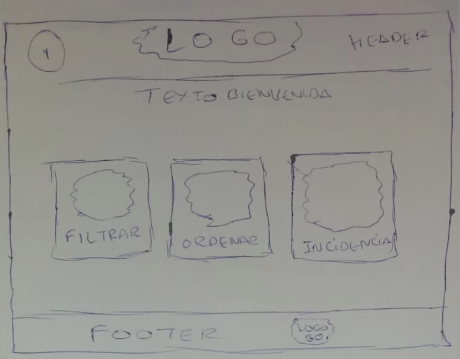

  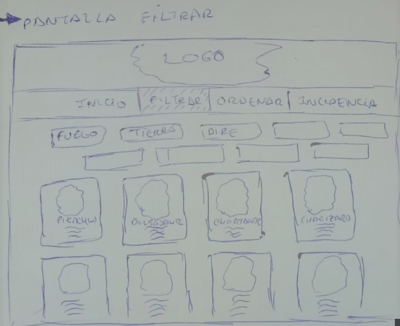

  

  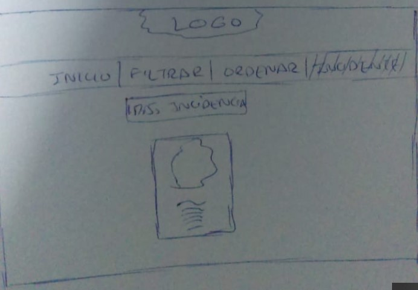

- Prototipo de Alta Fidelidad.
  Una vez definido el prototipo de baja fidelidad, se inicio con el prototipado de Alta Fidelidad utilizando la herramienta Figma.

  El prototipado de Alta Fidelidad se inicio para el diseño mobile:

  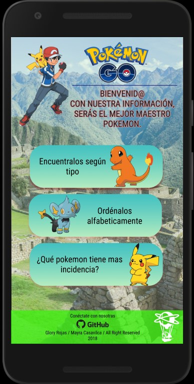

  Se muestra en la siguiente imagen el prototipo en alta fidelidad para desktop.

  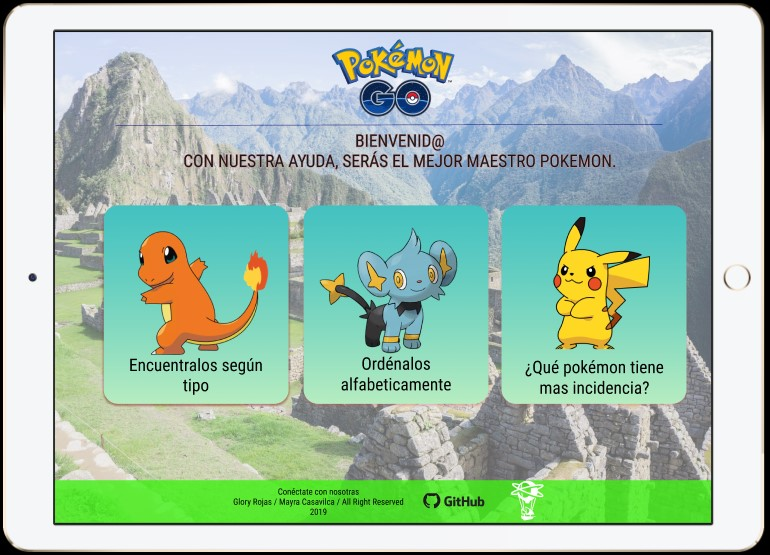


- Testeos de usabilidad.

Para la versión móvil en Android: Primer prototipo basado en el sketch de baja fidelidad.

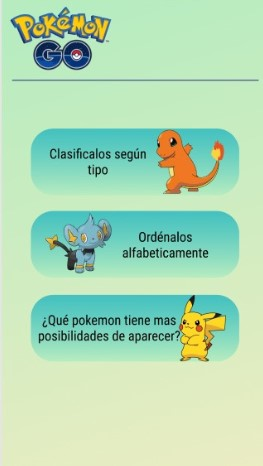

Luego de distintas iteraciones con los usuarios potenciales se  realizaron algunos cambios, básicamente por textos que no se entendían.  


Para versión Web:
Anteriormente se mostró como deberia quedar la aplicación.

El primer prototipo quedo de la siguiente manera:

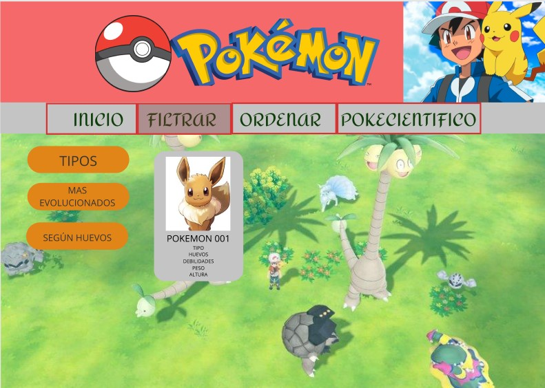

Funcionalmente el feedback de los encuestados indican que la app es sencilla y de facil entendimiento. Sin embargo los colores utilizados no los asocian con PokemonGo.

Al realizar los cambios y testear con los usuarios se obtuvieron los siguientes resultados:

Pantalla de Inicio:

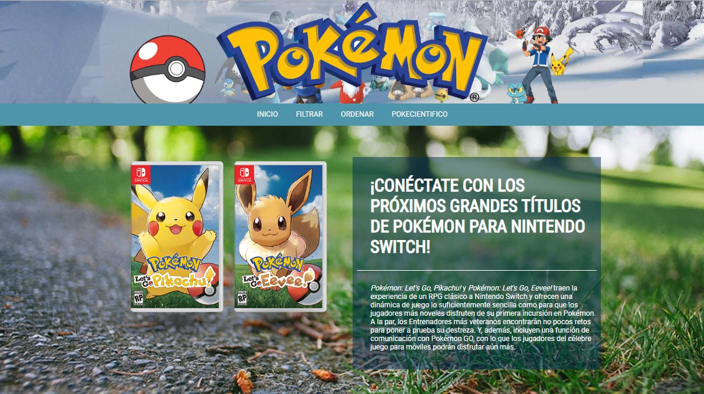

Pantalla de funcion filtrar:

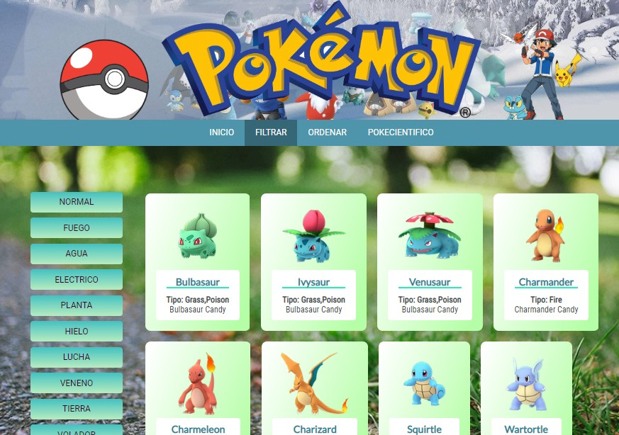

Pantalla de función ordenar:

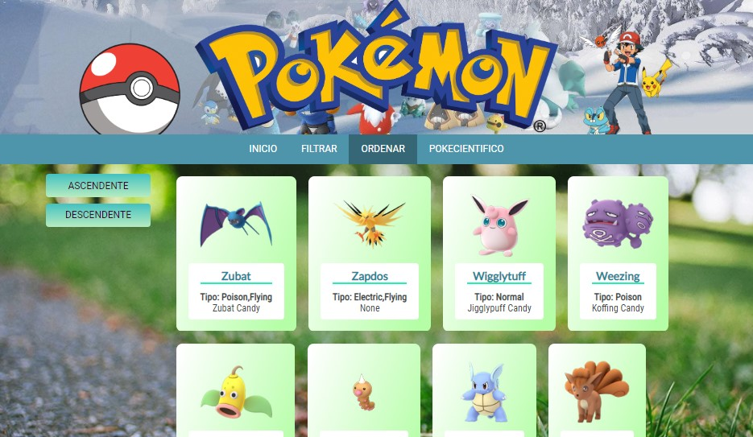

Pantalla de función pokecientifico:

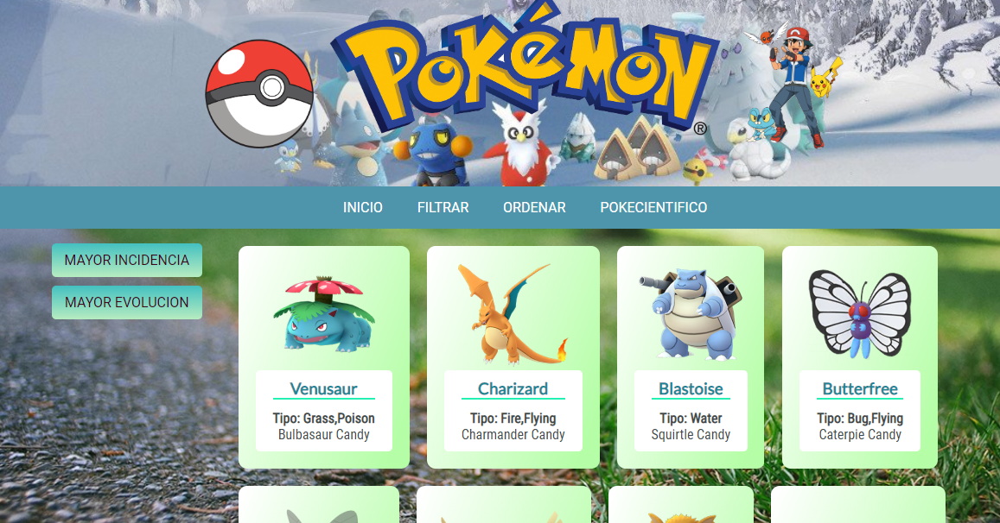


## Implementación de la Interfaz de Usuario (HTML/CSS/JS)

1. Mostrar la data en una interfaz:

  Todos los resultados de pokemones se muestran en cards.

  
2. Permitir al usuario filtrar, ordenar la data.

  Dentro del menú de navegación tenemos las opciones que el usuario desee realizar.

  
4. Cálculos estadisticos como minimos o máximos.

  La tercera funcion muestra en pantalla la opcion de encontrar al pokemon con mayor incidencia (dentro de la data, seria el pokemon con mayor avg_spawns).

  
5. Aplicación Responsive.
  La app se muestra de manera correcta en cualquier dispositivo movil.

## Pruebas unitarias
Se creó un objeto global Window llamado PokeLover dentro del cual se tienen todas las funciones del archivo data.js.

Se muestra imagen con los porcentajes de cobertura testeado.


=======
* [Preámbulo](#preámbulo)
* [Descripción](#resumen-del-proyecto)
* [Consideraciones generales](#consideraciones-generales)
* [Objetivos de aprendizaje](#objetivos-de-aprendizaje)
* [Parte obligatoria](#parte-obligatoria)
* [Parte opcional](#parte-opcional-hacker-edition)
* [Consideraciones técnicas](#consideraciones-técnicas)
* [Primeros pasos](#primeros-pasos)
* [Contenido de referencia](#contenido-de-referencia)
* [Checklist](#checklist)

***

## Preámbulo

Según un [estudio de IBM](https://www-01.ibm.com/common/ssi/cgi-bin/ssialias?htmlfid=WRL12345USEN),
el 90% de la data que existe hoy ha sido creada durante los últimos dos años.
Cada día generamos 2.5 trillones de bytes de datos, una cifra sin precedentes.

No obstante, los datos por sí mismos son de poca utilidad. Para que esas
grandes cantidades de datos se conviertan en **información** fácil de leer para
los usuarios, necesitamos entender y procesar estos datos. Una manera simple de
hacerlo es creando _interfaces_ y _visualizaciones_.

En la siguiente imagen, podrás ver cómo con la data que que se ve en la parte
izquierda se puede construir una interfaz amigable y entendible por el usuario.


\* Puedes ver el datalle de la data en este [link](https://gist.github.com/lalogf/dd4aa3017a9f8aa8f90dfbca382c4dc9#file-student-json)
y la interfaz construida en este [link](https://app.talento.laboratoria.la/profile/HFOoMpOreBU2psCcjjLg5O2EWEv2).

## Resumen del proyecto

En este proyecto **construirás una _página web_ para visualizar un
_conjunto (set) de datos_** que se adecúe a lo que descubras que tu usuario
necesita.

Esta vez te proponemos una serie de datos de diferentes _temáticas_ para que
explores y decidas con qué temática te interesa trabajar. Hemos elegido
específicamente estos sets de datos porque creemos que se adecúan bien a esta
etapa de tu aprendizaje.

Una vez que definas tu área de interés, entiende quién es tu usuario y qué
necesita saber o ver exactamente; luego podrás construir la interfaz que le
ayude a interactuar y entender mejor esos datos.

Estos son datos que te proponemos:

* Indicadores de desarrollo del Banco Mundial de algunos países (Brasil, Chile, 
  México y Perú). Estos datos incluyen indicadores demográficos, económicos y 
  comerciales.
* [Pokémon](src/data/pokemon/pokemon.json):
  En este set encontrarás una lista con los 151 Pokémon de la región de Kanto,
  junto con sus respectivas estadísticas usadas en el juego [Pokémon GO](pokemongolive.com).
* [Steam noticias](src/data/steam/steam.json):
  Lista noticias relacionadas a los videojuegos presentes en la
  plataforma de [Steam](https://store.steampowered.com/).
* [League of Legends - Challenger leaderboard](src/data/lol/lol.json):
  Este set de datos muestra la lista de jugadores en una liga del
  juego League of Legends (LoL), puedes revisar la documentación de su API en
  este [link](https://developer.riotgames.com/api-methods/).
* [Personas heridas por medio de transporte en EEUU](src/data/injuries/injuries.json).
  Este set nos muestra el número de personas heridas en accidentes de
  transporte, con data anual desde 1960 y categorizada por tipo de transporte
  (aire, barco, automóvil, moto, bicileta, ...).

Como entregable final tendrás una página web que permita **visualizar la data,
filtrarla, ordenarla y hacer algún calculo agregado**. Como aclaración,
con cálculo agregado nos referimos a distintos cálculos que puedes hacer con
la data que tienes para mostrar información aún más relevante a los usuarios.
Una opción serían cálculos estadísticos como el promedio, el máximo o el mínimo,
por ejemplo, si tenemos una colección que representa a un grupo de personas,
y cada persona está representada como un _objeto_ con una _propiedad_ `altura`,
podríamos elegir calcular la altura promedio en el grupo entre otras cosas.

Cada set de datos tiene una identidad gráfica que deberás utilizar en la
interfaz. La identidad gráfica; o también conocido como guía de estilos en
diseño, de cada set la podrás encontrar en el siguiente
[link](https://drive.google.com/open?id=1eeWFqrWpy-OYOH4EHDckFGunyrm9iNeE).

## Consideraciones generales

* Este proyecto se debe resolver en duplas.
* El proyecto será entregado subiendo tu código a GitHub (commit/push) y la
  interfaz será desplegada usando [GitHub Pages](https://pages.github.com/).
* Tiempo para completarlo: Toma como referencia 3 semanas. Trabaja durante el
  primer Sprint (una semana) y al  final, decide en cuántas semanas lo
  terminarás.

## Objetivos de aprendizaje

El objetivo principal de este proyecto es que aprendas a diseñar y construir una
interfaz web donde se pueda visualizar y manipular data, entendiendo lo que el
usuario necesita.

Dicho en palabras sencillas, aprenderás a:

* Aplicar y profundizar todo lo que aprendiste en el proyecto anterior.
* Pensar en las **necesidades de los usuarios** para crear historias de usuario.
* Escribir y trabajar con **historias de usuario**, sus definiciones de
  terminado (_definition of done_) en la organización y planificación de tu
  trabajo.
* Definir qué data y de qué forma mostrarla en el producto, basándote en
  tu **entendimiento del usuario**.
* Crear productos que sigan los **principios básicos de diseño visual** y
  las **heurísticas de usabilidad**.
* Iterar el diseño del producto, basándote en los resultados de los
  **tests de usabilidad**.
* Manipular **_arreglos_ (_arrays_) y _objetos_ (_objects_)**.
* **Manipular el DOM** (agregar elementos dinámicamente basados en la data).
* **Manejar eventos del DOM** para permitir interacción con el usuario
  (filtrado, ordenado, ...).
* Entender los beneficios y complejidades de **trabajar en equipo** en un
  ambiente de incertidumbre.

## Parte Obligatoria

Los criterios para considerar que has completado este proyecto son:

### Definición del producto

Documenta brevemente tu trabajo en el archivo `README.md` de tu repositorio,
contándonos cómo fue tu proceso de diseño y cómo crees que el producto resuelve
el problema (o problemas) que tiene tu usuario.

### Historias de usuario

Una vez que entiendas las necesidades de tu usuario, escribe las [Historias
de Usuario](https://es.wikipedia.org/wiki/Historias_de_usuario) que representen
todo lo que el usuario necesita hacer/ver. Asegúrate de incluir una definición
de terminado (_definition o done_) para cada una.

### Diseño de la Interfaz de Usuario

#### Prototipo de baja fidelidad

Durante tu trabajo deberás haber hecho e iterado sketches (boceto) de tu
solución usando papel y lápiz. Te recomendamos tomar fotos de todas las
iteraciones que realices, y las subas a tu repositorio, y las menciones en tu
`README.md`.

#### Prototipo de alta fidelidad

Lo siguiente es diseñar tu Interfaz de Usuario (UI por sus siglas en inglés -
_User Interface_). Para eso debes aprender a utilizar alguna herramienta de
diseño visual. Nosotros te recomendamos [Figma](https://www.figma.com/) que es
una herramienta que funciona en el navegador y, además, puedes crear una cuenta
gratis. Sin embargo, eres libre de utilizar otros editores gráficos como
Illustrator, Photoshop, PowerPoint, Keynote, etc. Recuerda utilizar la identidad
gráfica correspondiente a cada set de datos que elijas.

El diseño debe representar el _ideal_ de tu solución. Digamos que es lo que
desearías implementar si tuvieras tiempo ilimitado para hackear. Además, tu
diseño debe seguir los fundamentos de _visual design_. También, deberás exportar
tu diseño a [Zeplin](https://zeplin.io/) y utilizar las especificaciones de
estilo que te dé Zeplin al momento de implementar tus diseños en código.

#### Testeos de usabilidad

Durante el reto deberás realizar tests de usabilidad con distintos usuarios, y
en base a los resultados de esos tests, deberás iterar tus diseños. Cuéntanos
qué problemas de usabilidad detectaste a través de los tests y cómo los
mejoraste en tu propuesta final.

### Implementación de la Interfaz de Usuario (HTML/CSS/JS)

Luego de diseñar tu interfaz de usuario deberás trabajar en su implementación.
Como mencionamos, **no** es necesario que construyas la interfaz tal como la
diseñaste. Tendrás un tiempo limitado para hackear, así es que deberás
priorizar.

Como mínimo, tu implementación debe:

1. Mostrar la data en una interfaz: puede ser un card, una tabla, una lista, etc.
2. Permitir al usuario filtrar y ordenar la data.
3. Calcular estadísticas de la colección (o subcolección) como media aritmética,
   máximo y/o mínimo de algún atributo numérico, o contar cuántas veces aparece
   un determinado valor, por ejemplo.
4. Visualizarse sin problemas desde distintos tamaños de pantallas: móviles,
   tablets y desktops.

Es importante que tu interfaz, a pesar de ser una versión mínima de tu ideal,
siga los fundamentos de _visual design_.

### Pruebas unitarias

El _boilerplate_ de este proyecto no incluye pruebas unitarias, pero esperamos
que escribas tu propias pruebas unitarias para las funciones encargadas de
_procesar_, _filtrar_ y _ordenar_ la data, así como _calcular_ estadísticas.
Para ello te recomendamos implementar las siguientes funciones en el archivo
`src/data.js`:

* `filterData(data, condition)`: esta función `filter` o filtrar recibiría la
  data, y nos retornaría aquellos datos que sí cumplan con la condición.

* `sortData(data, sortBy, sortOrder)`: esta función `sort` u ordenar
  recibe tres parámetros.
  El primer parámetro, `data`, nos entrega los datos.
  El segundo parámetro, `sortBy`, nos dice con respecto a cuál de los campos de
  la data se quiere ordenar.
  El tercer parámetro, `sortOrder`, indica si se quiere ordenar de manera
  ascendente o descendente.

* `computeStats(data)`: la función `compute` o calcular, nos permitirá hacer
  cálculos estadísticos básicos para ser mostrados de acuerdo a la data
  proporcionada.

Estas son ideas de funciones que podrías implementar, pero esto depende de tu
propia implementación.

El archivo `src/data.js` tiene que tener una cobertura del 70% de _statements_
(_sentencias_), _functions_ (_funciones_), _lines_ (_líneas_), y _branches_
(_ramas_).

Estas funciones deben ser [_puras_](https://medium.com/laboratoria-developers/introducci%C3%B3n-a-la-programaci%C3%B3n-funcional-en-javascript-parte-2-funciones-puras-b99e08c2895d)
e independientes del DOM. Estas funciones serán después usadas desde el archivo
`src/main.js`, al cargar la página, y cada vez que el usuario interactúe (click,
filtrado, ordenado, ...).

## Parte Opcional (Hacker edition)

Features/características extra sugeridas:

* En lugar de consumir la data estática brindada en este repositorio, puedes
  consumir la data de forma dinámica, cargando un archivo JSON por medio de
  `fetch`. La carpeta `src/data` contiene una versión `.js` y una `.json` de
  de cada set datos.
* Agregarle a tu interfaz de usuario implementada visualizaciones gráficas. Para
  ello te recomendamos explorar librerías de gráficas como [Chart.js](https://www.chartjs.org/)
  o [Google Charts](https://developers.google.com/chart/).
* 100% Coverage

## Consideraciones técnicas

La lógica del proyecto debe estar implementada completamente en JavaScript
(ES6), HTML y CSS. En este proyecto NO está permitido usar librerías o
frameworks, solo [vanilla JavaScript](https://medium.com/laboratoria-how-to/vanillajs-vs-jquery-31e623bbd46e),
con la excepción de librerías para hacer gráficas (charts); ver
[_Parte opcional_](#parte-opcional-hacker-edition) más arriba.

No se debe utilizar la _pseudo-variable_ `this`.

El _boilerplate_ contiene una estructura de archivos como punto de partida así
como toda la configuración de dependencias:

```text
.
├── package.json
├── README.md
├── src
│   ├── data
│   │   ├── injuries
│   │   │   ├── injuries.js
│   │   │   └── injuries.json
│   │   ├── lol
│   │   │   ├── lol.js
│   │   │   └── lol.json
│   │   ├── pokemon
│   │   │   ├── pokemon.js
│   │   │   └── pokemon.json
│   │   ├── steam
│   │   │   ├── steam.js
│   │   │   └── steam.json
│   │   └── worldbank
│   │       ├── worldbank.js
│   │       └── worldbank.json
│   ├── data.js
│   ├── index.html
│   ├── main.js
│   └── style.css
└── test
    └── data.spec.js

8 directories, 17 files
```

### `src/index.html`

Al igual que en el proyecto anterior, existe un archivo `index.html`. Como ya
sabrás, acá va la página que se mostrará al usuario. También nos sirve para
indicar qué scripts se usarán y unir todo lo que hemos hecho.

En este archivo encontrarás una serie de _etiquetas_ (_tags_) `<script>`
_comentadas_. Para _cargar_ las diferentes fuentes de datos tendrás que
_descomentar_ estas _etiquetas_. Cada uno estos scripts asignará una variable
global con la data correspondiente a esa fuente de datos.

Por ejemplo, si descomentamos la siguiente línea:

```html
<!-- <script src="./data/worldbank/worldbank.js"></script> -->
```

La línea quedaría así:

```html
<script src="./data/worldbank/worldbank.js"></script>
```

Y ahora tendríamos la variable global `WORLDBANK` disponible en nuestros otros
scripts (como `src/data.js` o `src/main.js`).

### `src/main.js`

Recomendamos usar `src/main.js` para todo tu código que tenga que ver con
mostrar los datos en la pantalla. Con esto nos referimos básicamente a la
interacción con el DOM. Operaciones como creación de nodos, registro de
manejadores de eventos (_event listeners_ o _event handlers_), ....

Esta no es la única forma de dividir tu código, puedes usar más archivos y
carpetas, siempre y cuando la estructura sea clara para tus compañeras.

### `src/data.js`

El corazón de este proyecto es la manipulación de datos a través de arreglos y
objetos. La idea de este archivo es contener toda la funcionalidad
que corresponda a obtener, procesar y manipular datos.

En este archivo esperamos que implementes las funciones detalladas en la sección
de [_Pruebas Unitarias_](#pruebas-unitarias).

### `src/data`

En esta carpeta están los datos de las diferentes fuentes. Encontrarás una
carpeta por cada fuente, y dentro de cada carpeta dos archivos: uno con la
extensión `.js` y otro `.json`. Ambos archivos contienen la misma data; la
diferencia es que el `.js` lo usaremos a través de una etiqueta `<script>`,
mientras que el `.json` está ahí para opcionalmente cargar la data de forma
asíncrona con [`fetch()`](https://developer.mozilla.org/es/docs/Web/API/Fetch_API)
(ver sección de [_Parte Opcional_](#parte-opcional-hacker-edition)).

### `test/data.spec.js`

Tendrás también que completar las pruebas unitarias de las funciones
implementadas en el archivo `data.js`.

## Evaluación

Recuerda revisar la [rúbrica](https://docs.google.com/spreadsheets/u/1/d/e/2PACX-1vRktPN4ilZtkRN5tUb3DVhgeihwlzk63_-JI3moA-bXpKDbHDioAK2H3qbrwWNb0Ql4wX22Tgv7-PDv/pubhtml)
para ver la descripción detallada de cada habilidad y cada nivel. Esta es una
lista de todas las habilidades involucradas en este proyecto y que evaluaremos
cuando lo completes:

### General

| Característica/Habilidad |
|--------------------------|
| Completitud |

### Tech

| Habilidad |
|-----------|
| **JavaScript** |
| Estilo |
| Nomenclatura/semántica |
| Funciones/modularidad |
| Estructuras de datos |
| Tests |
| **HTML** |
| Validación |
| Estilo |
| Semántica |
| **CSS** |
| DRY |
| Responsive |
| **SCM** |
| Git |
| GitHub |
| **CS** |
| Lógica |
| Arquitectura |

### UX

| Habilidad |
|-----------|
| User Centricity |
| Entrevistas |
| Contraste |
| Alineación |
| Jerarquía |
| Tipografía |
| Color |

### Habilidades Blandas

| Habilidad |
|-----------|
| Planificación y organización |
| Autoaprendizaje |
| Solución de problemas |
| Dar y recibir feedback |
| Adaptabilidad |
| Trabajo en equipo |
| Comunicación eficaz |
| Presentaciones |

***

## Pistas sobre cómo empezar a trabajar en el proyecto

Antes de empezar a escribir código, debes definir qué deberá hacer el producto
en base al conocimiento que puedas obtener de tu usuario. Estas preguntas te
pueden ayudar:

* ¿Quiénes son los principales usuarios de producto?
* ¿Cuáles son los objetivos de estos usuarios en relación con el producto?
* ¿Cuáles son los datos más relevantes que quieren ver en la interfaz y por qué?
* ¿Cuándo utilizan o utilizarían el producto?

Cuando ya estés lista para codear, te sugerimos empezar de esta manera:

1. Una de las integrantes del equipo debe realizar un :fork_and_knife:
   [fork](https://help.github.com/articles/fork-a-repo/) del repo de tu cohort,
   tus _coaches_ te compartirán un _link_ a un repo y te darán acceso de lectura
   en ese repo. La otra integrante del equipo deber hacer un fork **del
   repositorio de su compañera** y [configurar](https://gist.github.com/BCasal/026e4c7f5c71418485c1)
   un `remote` hacia el mismo.
2. :arrow_down: [Clona](https://help.github.com/articles/cloning-a-repository/)
   tu _fork_ a tu computadora (copia local).
3. 📦 Instala las dependencias del proyecto con el comando `npm install`. Esto
   asume que has instalado [Node.js](https://nodejs.org/) (que incluye [npm](https://docs.npmjs.com/)).
4. Si todo ha ido bien, deberías poder ejecutar las :traffic_light:
   pruebas unitarias (unit tests) con el comando `npm test`.
5. A codear se ha dicho! :rocket:

<!--
En este proyecto deberás trabajar colaborativamente. Para ello, una de las
integrantes del equipo deberá forkear el repositorio del cohort y la otra
integrante **deberá hacer un fork del repositorio de su compañera**. Luego de
esto, deberás
[configurar](https://help.github.com/articles/configuring-a-remote-for-a-fork/)
un `remote` hacia el repositorio del cual hiciste el fork.

Para mandar cambios desde un repositorio forkeado al original debes crear un
[pull request](https://goo.gl/4bYnuh)
y el propietario del repositorio original recibirá una notificación para
[revisar el pull request](https://goo.gl/XSFcT5)
y [aceptar los cambios](https://goo.gl/HLJtqN).

Aquí algunas recomendaciones para que organices mejor el trabajo con tu
compañera:

* En lugar de trabajar en una sola rama o _branch_, puedes organizar el flujo de
  trabajo con dos ramas principales:
  - `master`: rama que contiene las funcionalidades terminadas y sin errores.
  - `develop`: rama dónde integrarás las funcionalidades conforme las vayas
    desarrollando.

* Además de tener las dos ramas anteriores, puedes trabajar cada nueva
  funcionalidad en una rama individual (_feature branches_), estas ramas en
  lugar de crearse a partir de `master`, tienen a `develop` como su rama de
  origen. Cuando una funcionalidad es terminada se integra de nuevo a `develop`.
  Las _feature branches_ no se deben integrar directamente a `master`.

* Por último, te sugerimos codear usando la técnica de
  [pair programming](https://goo.gl/uAMBX2).

¿Quieres saber más forks y pull requests?

* Un [fork](https://help.github.com/articles/fork-a-repo/) es una copia de un
  repositorio en el que puedes experimentar sin afectar al repositorio original.
  Generalmente se usa para proponer cambios al proyecto de alguien más o para
  usar el proyecto de otra persona como punto de partida para una idea que
  quieras realizar.

* Un [pull request](https://help.github.com/articles/about-pull-requests/) (PR)
  te permite solicitar la inclusión de cambios al repositorio original (tu punto
  de partida) en GitHub. Cuando un PR es abierto, este permite solicitar,
  discutir y revisar los cambios realizados con todos los colaboradores y
  agregar otros commits antes de que los cambios sean incluidos al repositorio
  original.
-->

***

## Contenido de referencia

### Diseño de experiencia de usuario (User Experience Design)

* Investigación con usuarios / entrevistas
* Principios de diseño visual

### Desarrollo Front-end

* Unidad de testing en curso de JavaScript en LMS.
* Unidad de arreglos en curso de JavaScript en LMS.
* Unidad de objetos en curso de JavaScript en LMS.
* Unidad de funciones en curso de JavaScript en LMS.
* Unidad de DOM en curso de Browser JavaScript en LMS.
* [Array en MDN](https://developer.mozilla.org/es/docs/Web/JavaScript/Referencia/Objetos_globales/Array)
* [Array.sort en MDN](https://developer.mozilla.org/es/docs/Web/JavaScript/Referencia/Objetos_globales/Array/sort)
* [Array.map en MDN](https://developer.mozilla.org/es/docs/Web/JavaScript/Referencia/Objetos_globales/Array/map)
* [Array.filter en MDN](https://developer.mozilla.org/es/docs/Web/JavaScript/Referencia/Objetos_globales/Array/filter)
* [Array.reduce en MDN](https://developer.mozilla.org/es/docs/Web/JavaScript/Referencia/Objetos_globales/Array/reduce)
* [Array.forEach en MDN](https://developer.mozilla.org/es/docs/Web/JavaScript/Referencia/Objetos_globales/Array/forEach)
* [Object.keys en MDN](https://developer.mozilla.org/es/docs/Web/JavaScript/Referencia/Objetos_globales/Object/keys)
* [Object.entries en MDN](https://developer.mozilla.org/es/docs/Web/JavaScript/Referencia/Objetos_globales/Object/entries)
* [Fetch API en MDN](https://developer.mozilla.org/en-US/docs/Web/API/Fetch_API)
* [json.org](https://json.org/json-es.html)

### Herramientas

* [Git](https://git-scm.com/)
* [GitHub](https://github.com/)
* [GitHub Pages](https://pages.github.com/)
* [Node.js](https://nodejs.org/)
* [Jest](https://jestjs.io/)

***

## Checklist

* [ ] Usa VanillaJS.
* [ ] No hace uso de `this`.
* [ ] Pasa linter (`npm pretest`)
* [ ] Pasa tests (`npm test`)
* [ ] Pruebas unitarias cubren un mínimo del 70% de statements, functions y
  lines y branches.
* [ ] Incluye _Definición del producto_ clara e informativa en `README.md`.
* [ ] Incluye historias de usuario en `README.md`.
* [ ] Incluye _sketch_ de la solución (prototipo de baja fidelidad) en
  `README.md`.
* [ ] Incluye _Diseño de la Interfaz de Usuario_ (prototipo de alta fidelidad)
  en `README.md`.
* [ ] Incluye link a Zeplin en `README.md`.
* [ ] Incluye el listado de problemas que detectaste a través de tests de
  usabilidad en el `README.md`.
* [ ] UI: Muestra lista y/o tabla con datos y/o indicadores.
* [ ] UI: Permite ordenar data por uno o más campos (asc y desc).
* [ ] UI: Permite filtrar data en base a una condición.
>>>>>>> 62cdbd37178e7f5270318674305e4435f402f414
