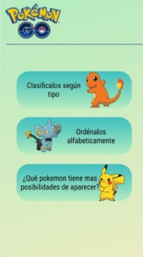
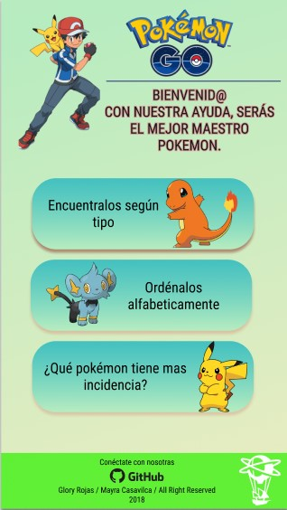
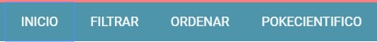
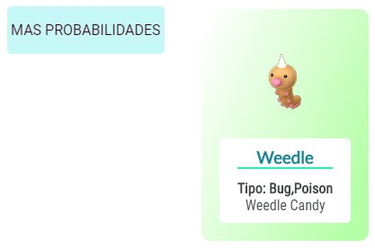
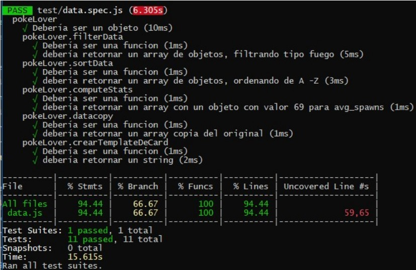

# Data Lovers

## Índice

* [Definición de Producto](#Definición-de-Producto)
* [Historias de Usuario](#Historias-de-Usuario)
* [Diseño de la Interfaz de Usuario](#Diseño-de-la-Interfaz-de-Usuario)
* [Implementación de la Interfaz de Usuario (HTML/CSS/JS)](#Implementación-de-la-Interfaz-de-Usuario-(HTML/CSS/JS))
* [Pruebas Unitarias](#Pruebas-Unitarias)

## Definición de Producto

PokeLover es una aplicación web que permitirá a los usuarios (principalmente jugadores de Pokémon GO) poder manejar información relevante de cada Pokémon e interactuar con ella para sacar ventaja respecto a los otros maestros Pokémon que aun no conocen nuestra app.

El desarrollo de las funciones que contiene la aplicación estan basadas en entrevistas realizadas a los potenciales consumidores de nuestro producto, estas entrevistas se resumieron en 3 historias de usuario especificadas líneas abajo en el siguiente punto.

La primera función es el filtro de los pokemones según tipo, como segunda utilidad tenemos el ordenamiento alfabetico ascendente y descendente, como tercera función el usuario podrá determinar cual es el pokemon con mayor incidencia entre los 150 de la Región Kanto.

El acceso a la aplicación Web "PokeLover" es mediante el siguiente Link: https://mayratc.github.io/lim-2018-11-bc-core-am-data-lovers/src/ , y se pude visualizar por cualquier dispositivo electrónico.

## Historias de Usuario
- Historia de Usuario N°1:

  "Yo como usuario de Pokemon GO, necesito clasificar los pokemones según el tipo al cual pertenecen."

  // La Definición de terminado es que a un lado de la pantalla se muestren botones con los diferentes nombres de los tipos de pokemones y que al usuario darle click a cada una de ellas, en otro lado de la pantalla figuren cards con los pokemones ordenados según el tipo que el usuario escogió.
- Historia de Usuario N°2:

  "Yo como usuario de Pokemon GO, desearia poder ordenar alfabeticamente a los Pokemones".

  // La Definicion de terminado de esta historia es: el menu de navegación de la aplicacion deberia mostrar un acceso con el nombre "ORDENAR", al darle click deberia mostrarnos una pantalla con dos opciones "ASCENDENTE" y "DESCENDENTE", al darle click a los botones se deberian mostrar cards de cada pokemon, y deberian estar ordenados alfabeticamente según la opcion elegida.

- Historia de Usuario N°3:

  "Yo como usuario de Pokemon Go, quiero saber cuál es el pokemon con mayor incidencia dentro de los 150 pokemones de la región de Kanto."

  //La Definición de terminado aqui seria un boton en el menu de navegación con el nombre "POKECIENTIFICO" en el cual al darle click la pantalla muestre un boton adicional con el nombre "MAS POSIBILIDADES" y éste último al darle click muestre en pantalla la card del pokemon con mayor % de incidencia.

## Diseño de la Interfaz de Usuario
- Prototipo de Baja Fidelidad.

  Para trabajar los prototipos de baja fidelidad, se testearon las soluciones con los usuarios potenciales, se muestran líneas abajo los sketches trabajados a mano.

- Prototipo de Alta Fidelidad.
  Una vez definido el prototipo de baja fidelidad, se inicio con el prototipado de Alta Fidelidad utilizando la herramienta Figma.

- Testeos de usabilidad.

Para la versión movil en Android: Primer prototipo basado en el sketch de baja fidelidad.

Luego de distintas iteraciones con los usuarios potenciales se  realizaron algunos cambios, básicamente por textos que no se entendían.  

Para versión Web:
Como deberia quedar la pagina inicial de la version web de la aplicación:

## Implementación de la Interfaz de Usuario (HTML/CSS/JS)

1. Mostrar la data en una interfaz:

  Todos los resultados de pokemones se muestran en cards.

  

2. Permitir al usuario filtrar, ordenar la data.

  Dentro del menú de navegación tenemos las opciones que el usuario desee realizar.

  

4. Cálculos estadisticos como minimos o máximos.

  La tercera funcion muestra en pantalla la opcion de encontrar al pokemon con mayor incidencia (dentro de la data, seria el pokemon con mayor avg_spawns).

  

5. Aplicación Responsive.
  La app se muestra de manera correcta en cualquier dispositivo movil.

## Pruebas unitarias
Se creó un objeto global Window llamado PokeLover dentro del cual se tienen todas las funciones del archivo data.js.

Se muestra imagen con los porcentajes de cobertura testeado.

